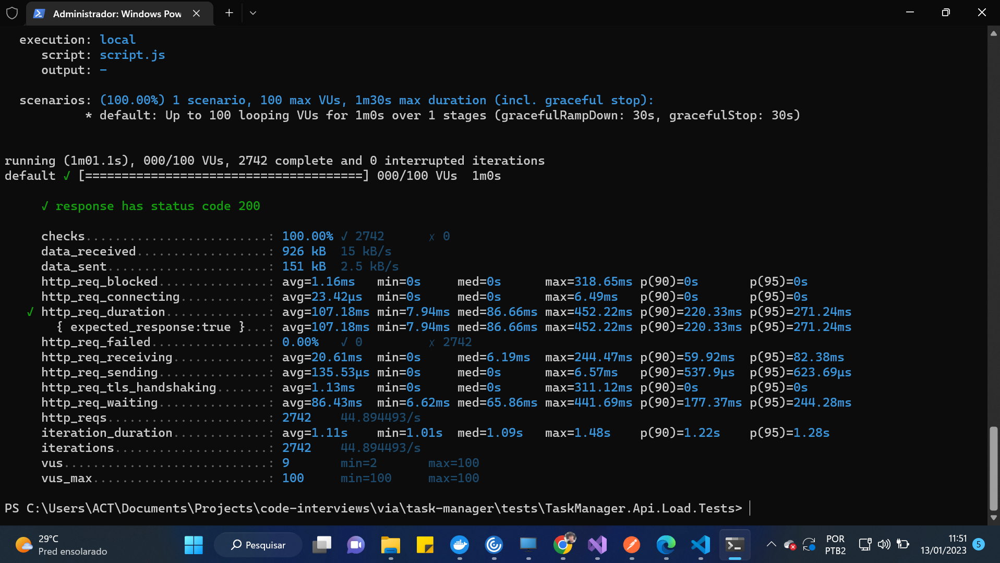

# FAQs

## How to run the project?

Use docker compose through its cli or an IDE such as Visual Studio for an intuitive approach.

Example:


## How to run load test

```
k6 run script.js
```

## Metrics from load test



PS: Ensure you have accessed the MySQL database and has created the table structure in the Migrations folder.
